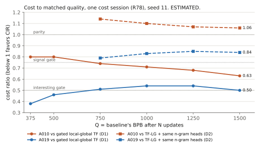

# CIR

CIR is an active DotrixAI research program investigating AI architectures and learning systems with lower cost-to-capability than strong Transformer systems.

**Status: Active Research** · Snapshot: 2026-10-04 07:15 UTC · Website: [dotrixai.com/cir](https://dotrixai.com/cir)

> This repository documents research in progress. Results are provisional unless marked REPRODUCED or VALIDATED. Candidates and claims may be superseded as stronger baselines and new evidence arrive, and several already have been. It contains research documentation only, not the CIR implementation.

## Objective

CIR searches for systems that make this ratio substantially smaller than 1:

```
TotalCost(CIR, Q) / TotalCost(Strong Transformer, Q)
```

`Q` is a matched capability level: both systems must reach the same quality before their costs are compared. Total cost is economic cost (training compute and wall-clock, hardware utilization, memory and optimizer state, data exposure, infrastructure), not FLOPs, parameter count, BPB or tokens per second in isolation.

Impact gates: `≤ 0.75` signal, `≤ 0.50` interesting, `≤ 0.20` industry-level, `≤ 0.10` breakthrough-level. These are a scale of impact, not milestones that have been reached.

Every claim is reported against two denominators:

- **D1, standard:** a strong Transformer with fair, generic improvements (optimizer, gating, positional encoding, local/global attention, tuning).
- **D2, matched modules:** the same Transformer given every generic module the CIR candidate uses. D2 isolates what is specific to CIR.

The cheapest fair Transformer known at the time of a claim is a mandatory comparator.

## Current research status

Scope of everything below: about 4M parameters (one additional width at about 7M), 4,096-token context, batch 8, at most 1,500 updates (about 49M tokens), English and Indonesian text, one commodity laptop CPU. No GPU results.

- **Strongest reproduced candidate:** A010, two delta-rule recurrent mixing layers followed by one full softmax attention layer, trained with Muon.
- **Strongest baseline:** B1A, a Transformer with a single global attention layer. It matches our previous best baseline in BPB at about 0.50× its cost per token. It was found by CIR's own baseline attack.
- **Reproduced signal (two seeds):** A010 reaches the final quality of a gated local-global Transformer at **0.633–0.643×** its training cost, and of a gated full-attention Transformer at **0.59–0.63×** (ESTIMATED). At early quality levels the ratio is 0.78–0.82.
- **Against the cheapest Transformer (B1A):** A010 needs about **1.23–1.27×** the cost to reach the same BPB; at equal compute the two tie. Its associative-recall advantage is **0.74–1.0×**, i.e. marginal (ESTIMATED, one seed).
- **Generic modules:** when the Transformer is given the same static n-gram heads, the recurrent-specific advantage falls to about zero. The Engram memory module helps the Transformer more than it helps A010.
- **Scaling:** three small widths tested. Against B1A the update-efficiency ratio stays at 0.70–0.71 from 4M to 7M parameters, so the cost ratio stays around 1.23. Nothing is known above about 7M parameters.
- **Capabilities:** BPB, copying, associative recall and bracket closing have been probed. Grammar, binding, reasoning and coherent generation are not measurable at this scale.
- **Under attack now:** R81 tests a cheaper hybrid (A025, thin recurrent mixers on B1A). Interim curves suggest it keeps only a small part of A010's margin; the formal verdict is pending.

**Honest summary: CIR currently has no robust cost advantage over the cheapest fair Transformer we know. The program objective has not been reached.**

Details: [docs/current-state.md](docs/current-state.md).

## Current evidence

| Finding | Status | Interpretation | Main limitation |
|---|---|---|---|
| A010 vs gated local-global Transformer: 0.041 lower BPB, cost 0.633–0.643 at final Q | REPRODUCED, CONTESTED | Real advantage over that baseline | Baseline no longer the cheapest; its learning rate was inherited, not screened |
| A010 vs gated full-attention Transformer: 0.034 lower BPB, cost 0.59–0.63 | REPRODUCED | Holds against the strongest Transformer in quality tested | Full attention is an expensive baseline at this scale |
| B1A matches local-global BPB (within 0.005) at 0.502× cost per token | SUPPORTED | Earlier D1 cost ratios used an inefficient baseline | One seed |
| A010 vs B1A: BPB cost 1.23–1.27×; tie at equal compute | PROVISIONAL | No BPB cost advantage against the cheapest Transformer | One seed per arm |
| Associative-recall cost vs cheapest Transformers: 0.74–1.0× | CONTESTED | Marginal; large recall advantages only against expensive Transformers | Depends on quality level and seed |
| Static n-gram heads (A019): 0.50 vs D1, 0.84 vs D2 | CONTESTED | Gain comes from a generic, prior-art module | One seed |
| Recall cost 0.36–0.69 | SUPERSEDED | Estimator was biased toward CIR | Corrected method in use |
| Pure delta-rule recurrence at 0.587 | SUPERSEDED | Held only under AdamW; reversed under Muon | Kept for history |

Full table: [results/current-evidence.md](results/current-evidence.md) · machine-readable: [results/evidence-table.csv](results/evidence-table.csv).



## Research principles

- **Strong adversarial baselines.** A dedicated lane tries to make the Transformer beat CIR. Claims that do not survive are withdrawn or narrowed ([baseline-adversary](docs/baseline-adversary.md)).
- **Cost-to-capability, as a curve.** Cost is reported at several quality levels, decomposed as `ρ_u × ρ_c` ([cost-to-capability](docs/cost-to-capability.md)).
- **Discovery vs confirmation.** Short runs find candidates; confirmation needs a full run, a second seed, a baseline attack and canonical cost measurement.
- **Frozen criteria.** Pass/fail criteria and predictions are written before results exist.
- **Negative results reduce the search space** and are published ([falsified-and-superseded](docs/falsified-and-superseded.md)).
- **Mechanistic diagnosis** before building on a result.
- **First-principles and de-novo search,** including analytic bounds on what a candidate family could possibly achieve.
- **Multi-fidelity experiments:** analysis and evaluation-only probes before training runs.
- **Evidence updates beliefs.** Every knowledge item carries an epistemic status ([methodology](docs/methodology.md)).

## What has not been proven

- Any behavior above about 7M parameters, beyond 1,500 updates, or beyond 4,096 tokens of context in the current candidate family.
- Any advantage over the cheapest fair Transformer known (B1A).
- Reasoning, grammar, binding, robustness or coherent generation parity; these are not yet measurable at this scale.
- Any advantage on GPUs, other CPUs or other hardware.
- Commercial readiness. DotrixAI does not currently offer CIR technology for license.
- Architectural novelty. The recurrent mixers, n-gram heads and memory modules all have close prior art ([architecture](docs/architecture.md#prior-art)).

## Repository map

| Path | Contents |
|---|---|
| [docs/overview.md](docs/overview.md) | What CIR is and how to read this repository |
| [docs/objective.md](docs/objective.md) | Objective, gates, denominators, number labels |
| [docs/methodology.md](docs/methodology.md) | Public summary of the research method |
| [docs/current-state.md](docs/current-state.md) | Dated snapshot of the current state |
| [docs/architecture.md](docs/architecture.md) | High-level description of candidates and baselines |
| [docs/cost-to-capability.md](docs/cost-to-capability.md) | Cost decomposition and cost-to-Q curves |
| [docs/capabilities.md](docs/capabilities.md) | Capability probes and their status |
| [docs/scaling.md](docs/scaling.md) | What is known about scale |
| [docs/baseline-adversary.md](docs/baseline-adversary.md) | How baselines were strengthened and what that did to claims |
| [docs/falsified-and-superseded.md](docs/falsified-and-superseded.md) | Results we no longer believe, and why |
| [docs/limitations.md](docs/limitations.md) | Limitations and open questions |
| [docs/research-timeline.md](docs/research-timeline.md) | Major turning points |
| [docs/publication-policy.md](docs/publication-policy.md) | What is and is not published |
| [results/](results/) | Evidence snapshot and CSV tables |
| [figures/](figures/) | Charts generated from the CSV tables |

## Links

- DotrixAI: https://dotrixai.com
- CIR research page: https://dotrixai.com/cir
- X: https://x.com/dotrixai

## License and citation

Research documentation only. See [LICENSE](LICENSE): publication does not grant rights to DotrixAI technology, implementations, patents or unpublished materials. To cite, see [CITATION.cff](CITATION.cff).
