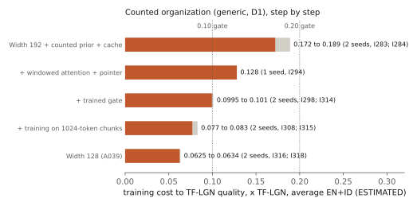

# CIR

CIR is an active DotrixAI research program investigating AI architectures and learning systems with lower cost-to-capability than strong Transformer systems.

**Status: Active Research** · Snapshot: 2026-10-10 07:47 UTC · Website: [dotrixai.com/cir](https://dotrixai.com/cir)

> This repository documents research in progress. Results are provisional unless marked REPRODUCED or VALIDATED. Candidates and claims may be superseded as stronger baselines and new evidence arrive, and several already have been. It contains research documentation only, not the CIR implementation.

## Objective

CIR searches for systems that make this ratio substantially smaller than 1:

```
TotalCost(CIR, Q) / TotalCost(Strong Transformer, Q)
```

`Q` is a matched capability level: both systems must reach the same quality before their costs are compared. Total cost is economic cost (training compute and wall-clock, hardware utilization, memory and optimizer state, data exposure, infrastructure), not FLOPs, parameter count, BPB or tokens per second in isolation.

Impact gates: `≤ 0.75` signal, `≤ 0.50` interesting, `≤ 0.20` industry-level, `≤ 0.10` breakthrough-level. These are a scale of impact, not milestones that have been reached.

Every claim is reported against two denominators:

- **D1, standard:** a strong Transformer with fair, generic improvements (optimizer, gating, positional encoding, local/global attention, tuning).
- **D2, matched modules:** the same Transformer given every generic module the CIR candidate uses. D2 isolates what is specific to CIR.

The cheapest fair Transformer known at the time of a claim is a mandatory comparator.

## Current research status

Snapshot 2026-10-10. Dated history: [docs/research-log.md](docs/research-log.md). Scope: networks up to 1.4M parameters (counted organization) and up to about 7M (CIR mixers), 4,096-token context, English and Indonesian text, one commodity laptop CPU. No GPU results.

- **CIR-specific architectures (D2): objective not reached.** Delta-rule recurrent mixers and their hybrids have no cost advantage over the cheapest fair Transformer (B1A, one global attention layer). The cheapest hybrid breaks even (0.949–0.985×); A010 costs 1.23–1.27×. An analytic bound rules out mixer substitution as a route to 0.50 at this context length. The family is closed for general language modeling at this scale.
- **Generic counted organization (D1): the main line now.** A small one-attention Transformer combined with counted n-gram statistics, an in-context cache, a longest-match pointer and a tiny trained gate reaches the final quality of a strong Transformer (TF-LGN) at **0.0625–0.0634× its training cost** averaged over English and Indonesian, on two seeds (ESTIMATED). A cheaper-inference variant prefills text at 0.48× TF-LGN's cost.
- **Per language the picture is uneven.** Indonesian: **0.032×**. English: **0.149×** at best, and the advantage over B1A disappears at 2× and 4× budget, where the small English corpus repeats many times. R161 is testing whether repetition, rather than language, is the cause.
- **This is not a new method.** The organization matches published prior art (modded-nanogpt PR #380, infini-gram, cache language models). CIR's contribution is matched-quality cost accounting that was attacked, reproduced across seeds and corrected on small hardware.
- **Capabilities:** the counted organization copies long spans better than TF-LGN (3.1–3.3 vs 2.89 bits) and reaches 0.99 exact recall only with its gate. Grammar, binding, reasoning and coherent generation are not measurable at this scale.
- **Scaling:** flat average ratio across a 0.5×–4× budget ladder against B1A; nothing is known above 1.4M parameters, about 200M tokens, or opponents larger than width 448.

**Honest summary: the breakthrough gate (≤ 0.10×) is passed only on average and in Indonesian, at small scale, by a generic and previously published organization. It is not established in English, at scale, or for any CIR-specific architecture.**

Details: [docs/current-state.md](docs/current-state.md).

## Current evidence

| Finding | Status | Interpretation | Main limitation |
|---|---|---|---|
| Counted organization A039 vs TF-LGN, average EN+ID: 0.0625 / 0.0634× | REPRODUCED | Cheapest organization measured; passes 0.10 on average | Generic, prior art; average carried by Indonesian |
| Same, per language: ID 0.032×, EN 0.149× at best (A039 does not reach EN target) | SUPPORTED | Breakthrough level in Indonesian, industry level in English | English from one run; repetition differs by language |
| English vs B1A at 2× and 4× budget: target not reached | CONTESTED | English gain fades as data repeats | Cause under test (R161) |
| Inference prefill 0.48–0.49× TF-LGN | REPRODUCED | Cheaper to read text, not only to train | Decode unmeasured; tables about 434 MB |
| Unseen Indonesian Wikipedia: 0.053 / 0.055× | REPRODUCED | Advantage survives text outside training | Same language; gate needs in-domain text |
| A025 (thin hybrid) vs B1A: 0.985 (0.949 optimized) | FALSIFIED as a cost candidate | CIR hybrid family breaks even with the cheapest Transformer | One seed; this regime |
| A010 vs B1A: BPB cost 1.23–1.27×; tie at equal compute | PROVISIONAL | No CIR-specific BPB advantage | One seed per arm |
| A010 vs gated local-global Transformer: 0.633–0.643 | REPRODUCED, CONTESTED | Real advantage over that baseline only | Baseline not the cheapest |
| State tracking: CIR recurrence learns parity and A5; cost vs Transformer + chain-of-thought | FALSIFIED (cost) | Capability real, cost advantage not | Tiny models, synthetic tasks |
| Formal-language pre-pretraining at 4M | FALSIFIED | Hurts both organizations, CIR more | Published gains are at 160M+ |
| Ratios against TF-LGN before 2026-10-08 | SUPERSEDED | Bridged cost estimate was about 5% low | All figures corrected |

Full table: [results/current-evidence.md](results/current-evidence.md) · machine-readable: [results/evidence-table.csv](results/evidence-table.csv).



## Research principles

- **Strong adversarial baselines.** A dedicated lane tries to make the Transformer beat CIR. Claims that do not survive are withdrawn or narrowed ([baseline-adversary](docs/baseline-adversary.md)).
- **Cost-to-capability, as a curve.** Cost is reported at several quality levels, decomposed as `ρ_u × ρ_c` ([cost-to-capability](docs/cost-to-capability.md)).
- **Discovery vs confirmation.** Short runs find candidates; confirmation needs a full run, a second seed, a baseline attack and canonical cost measurement.
- **Frozen criteria.** Pass/fail criteria and predictions are written before results exist.
- **Negative results reduce the search space** and are published ([falsified-and-superseded](docs/falsified-and-superseded.md)).
- **Mechanistic diagnosis** before building on a result.
- **First-principles and de-novo search,** including analytic bounds on what a candidate family could possibly achieve.
- **Multi-fidelity experiments:** analysis and evaluation-only probes before training runs.
- **Evidence updates beliefs.** Every knowledge item carries an epistemic status ([methodology](docs/methodology.md)).

## What has not been proven

- Any behavior above about 7M parameters, beyond 1,500 updates, or beyond 4,096 tokens of context in the current candidate family.
- Any cost advantage of a CIR-specific architecture over the cheapest fair Transformer known (B1A).
- A cost advantage of the counted organization in English, above about 1.4M parameters, or above 4× budget.
- Token-by-token decode cost, and memory-constrained deployment.
- Reliable emergence of state tracking inside a language model, or any language benefit from it.
- Reasoning, grammar, binding, robustness or coherent generation parity; these are not yet measurable at this scale.
- Any advantage on GPUs, other CPUs or other hardware.
- Commercial readiness. DotrixAI does not currently offer CIR technology for license.
- Architectural novelty. The recurrent mixers, n-gram heads and memory modules all have close prior art ([architecture](docs/architecture.md#prior-art)).

## Repository map

| Path | Contents |
|---|---|
| [docs/overview.md](docs/overview.md) | What CIR is and how to read this repository |
| [docs/objective.md](docs/objective.md) | Objective, gates, denominators, number labels |
| [docs/methodology.md](docs/methodology.md) | Public summary of the research method |
| [docs/current-state.md](docs/current-state.md) | Dated snapshot of the current state |
| [docs/research-log.md](docs/research-log.md) | Every public snapshot, newest first |
| [docs/architecture.md](docs/architecture.md) | High-level description of candidates and baselines |
| [docs/cost-to-capability.md](docs/cost-to-capability.md) | Cost decomposition and cost-to-Q curves |
| [docs/capabilities.md](docs/capabilities.md) | Capability probes and their status |
| [docs/scaling.md](docs/scaling.md) | What is known about scale |
| [docs/baseline-adversary.md](docs/baseline-adversary.md) | How baselines were strengthened and what that did to claims |
| [docs/falsified-and-superseded.md](docs/falsified-and-superseded.md) | Results we no longer believe, and why |
| [docs/limitations.md](docs/limitations.md) | Limitations and open questions |
| [docs/research-timeline.md](docs/research-timeline.md) | Major turning points |
| [docs/publication-policy.md](docs/publication-policy.md) | What is and is not published |
| [results/](results/) | Evidence snapshot and CSV tables |
| [figures/](figures/) | Charts generated from the CSV tables |

## Links

- DotrixAI: https://dotrixai.com
- CIR research page: https://dotrixai.com/cir
- X: https://x.com/dotrixai
- GitHub: https://github.com/dotrixai

## License and citation

Research documentation only. See [LICENSE](LICENSE): publication does not grant rights to DotrixAI technology, implementations, patents or unpublished materials. To cite, see [CITATION.cff](CITATION.cff).
