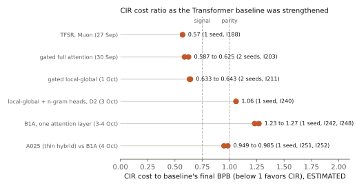

# Baseline adversary

CIR deliberately strengthens the Transformer it competes against. A dedicated lane tries to make the Transformer win, using any fair, generic improvement. Each upgrade below changed or removed a CIR claim. This history is the main reason to trust the claims that remain, and the main reason so few remain.

| Date (2026) | Baseline upgrade | Effect on the CIR claim | Evidence |
|---|---|---|---|
| 26–27 Sep | **Optimizer: Muon for both arms** (previously AdamW) | Pure delta-rule recurrence had reached 0.587–0.594 against an AdamW Transformer. Under Muon the Transformer overtook it after about 500 updates and finished 0.051 BPB better. **Claim withdrawn.** | I158, I177 |
| 27 Sep | Mechanism probe of the stronger Transformer | Muon makes induction heads form early (enrichment 14× at 625 updates vs 2.3× under AdamW). The earlier recurrent advantage was slow Transformer learning, not a structural edge. Led to the hybrid A010. | I179, I182 |
| 27–30 Sep | **Gated blocks for the Transformer** (same block design as CIR arms) | Strongest Transformer in quality. A010's lead narrowed from 0.065 to 0.034 BPB; cost ratio 0.587–0.625 in two seeds. **Claim narrowed.** | I188, I203 |
| 1 Oct | **Local-global attention** (window 512 in layers 0–1) | Nearly equal quality at 0.907× cost per update. A010 vs this baseline: 0.633–0.643 at final Q, but 0.78–0.82 at early Q. **Claim narrowed.** | I209, I211 |
| 3 Oct | **Learning-rate screening for baselines** (red-team) | The local-global baseline's learning rate had been inherited. Dependent claims marked CONTESTED; screening made mandatory for every comparator. | red-team, 3 Oct |
| 3 Oct | **Engram memory** on both sides | Helps the Transformer more (0.118 vs 0.093 BPB at 750 updates). Transformer + Engram at 750 updates beat the plain Transformer at 1,500. Closes about 63% of A010's margin. **Claim weakened.** | I224 |
| 3 Oct | **Static n-gram heads** on both sides | With the same heads, A019's lead over the Transformer fell to 0.004 BPB at 750 updates; A010 became 1.06× the cost of the Transformer with n-gram heads. **Recurrent-specific advantage ≈ 0 under D2.** | I228, I240 |
| 3 Oct | **One global attention layer (B1A):** remove mixers from layers 0–1 | Matches the local-global Transformer in BPB at 0.502× cost per update. A010 becomes 1.23–1.27× in BPB cost. **BPB claim lost.** | I242, I248 |
| 4 Oct | **Equal-compute attack:** B1A widened to A010's cost per update | BPB tie (0.0023). Recall slightly better for A010. | I244 |
| 4 Oct | **Estimator audit** (recall cost) | Comparator was charged its full budget although its recall had plateaued. Corrected recall advantage vs cheapest Transformers: 0.74–1.0. **Capability claim weakened to marginal.** | I245 |
| 4 Oct | **Windowed B1A** (probe, then canonical timing) | Windowing B1A's attention to 512 costs up to 0.010 BPB and saves only 8.6% per update on this CPU (estimated beforehand at 10–30%). Not cheaper to matched quality, so **B1A stays the frontier**. | I247, I252 |
| 4 Oct | **Cheapest hybrid against B1A** (R81, R82) | A025, B1A plus thin recurrent mixers, breaks even (0.985×; 0.949× with an optimized implementation). **Delta-hybrid family closed** at context ≤ 4,096. | I251, I252 |

Values come from different cost sessions and are ESTIMATED; each is comparable only to its own baseline.

## Rules that came out of this

- The cheapest fair Transformer known is a mandatory comparator for every new claim.
- Every comparator family gets its own learning-rate screen.
- Every cost claim must survive a "remove the mixing layers" attack and an equal-compute attack.
- Claims are reported under D1 and D2 side by side.
- Literature is checked before running expensive attacks that ask whether a baseline is a small-scale artifact (B1A's legitimacy was checked against published work on attention-sparse Transformers).
